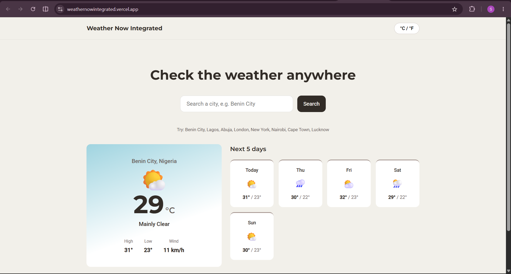

# Weather Now Integrated
A Complete full-stack weather application, built in four stages across the DecodeLabs Full Stack Development internship (3rd September - 3rd October, Cohort 2026): a responsive frontend, a RESTful API, a real database, and - in this final stage, all three wired together into one working system.

## Image


## Live demo
[View The Live Demo](https://weathernowintegrated.vercel.app/)
[View The API Docs](https://weathernowbackend.vercel.app/docs/)

## What this project demonstrates
| Stage | What it added | Tech |
|---|---|---|
| 1. Frontend | A responsive, accessible UI - no frameworks | HTML5, CSS3, vanilla JavaScript |
| 2. Backend API | RESTful endpoints, request validation | FastAPI |
| 3. Database | Persistent storage, a real relational schema, full CRUD | PostgreSQL (Neon), SQLAlchemy |
| 4. Integration | The frontend now calls the live API directly - real network requests, not mock data | `fetch()`, async/await |

Each stage was originally built and verified as its own milestone. This repo brings them together as one working application, rather than three components that happened to share a name.

## Project structure
```
├── index.html      # Page structure and content
├── styles.css      # All styling, tokens, and responsive breakpoints
├── script.js       # Local weather dataset, rendering, unit toggle
├── Screenshot.png  # Live Page Screenshot
└── README.md
```

## How it fits together
1. **`index.html`** defines the search form, weather dashboard, and forecast layout. It loads `styles.css` for presentation and `script.js` for the application logic.
2. **`script.js`** reads the city entered by the user and requests its weather data from the deployed Weather Now API at `https://weathernowbackend.vercel.app/weather/` using `fetch()`.
3. When the API returns successfully, `script.js` updates the dashboard with the current conditions and forecast. It also handles loading, empty-result, and error states, while `styles.css` keeps the interface responsive across screen sizes.

## Notes
- If the demo looks broken shortly after being idle, that's sometimes expected: free-tier hosting (Neon) can take a few seconds to wake back up on the first request after inactivity - it recovers on its own, no action needed.

## License
Free to use and adapt.